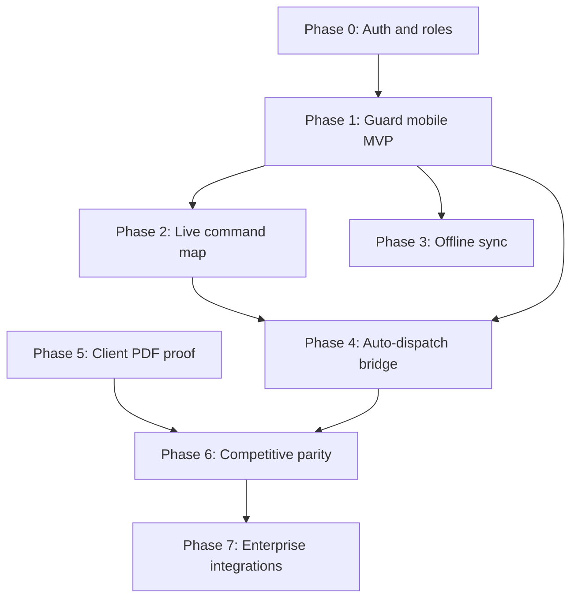

# Guard Monitoring — Phased Delivery Checklist

File-by-file implementation guide for closing the gap between SecureHub’s **guarding backend/admin** and **enterprise field operations**. Complements [guard-monitoring-system-roadmap.md](./guard-monitoring-system-roadmap.md).

**Legend**

| Symbol | Meaning |
|--------|---------|
| ✅ | Exists today — extend, don’t rewrite |
| 🆕 | New file or major new surface |
| 🔧 | Modify existing |
| 🧪 | Add/extend tests |

---

## Dependency overview



**Critical path to MVP:** Phase 0 → Phase 1 → Phase 2 → Phase 4 (partial) → Phase 5.

---

## Current baseline (do not rebuild)

| Area | Primary locations |
|------|-------------------|
| Domain models | `backend/apps/guarding/models.py` |
| Business logic | `backend/apps/guarding/services.py` |
| REST API (staff + `me/*`) | `backend/apps/guarding/views.py`, `serializers.py`, `urls.py` |
| Celery automation (60s beat) | `backend/apps/guarding/tasks.py`, `backend/config/settings.py` (`run-guarding-automation`) |
| Admin UI | `backend/apps/dashboard/views.py` (`Guarding*View`), `templates/dashboard/guarding_*.html` |
| API tests | `backend/apps/guarding/tests.py` |
| Emergency (customer) | `backend/apps/emergency/` |
| Alarms / Hik | `backend/apps/alarms/` |
| Customer mobile | `securehub_mobile/lib/` (no guard feature module yet) |
| Dispatch FKs | `DispatchTask.alarm_event`, `DispatchTask.emergency_request` in `models.py` |

---

## Phase 0 — Auth, roles, and API discoverability

**Goal:** One login can resolve **customer vs guard vs staff** so mobile and push routing work.

**Success criteria**

- `GET /api/v1/profile/` returns `account_kind: customer | guard | staff` and `guard_profile_id` when applicable.
- Guards can obtain JWT via existing token endpoint with linked `GuardProfile.user`.
- OpenAPI documents all `me/*` guarding routes.

| Action | Path | Notes |
|--------|------|-------|
| 🔧 | `backend/apps/accounts/views.py` (`ProfileView`) | Add guard detection via `GuardProfile.objects.filter(user=request.user)` |
| 🔧 | `backend/apps/accounts/serializers.py` | Extend profile payload (or inline in view) |
| 🧪 | `backend/apps/accounts/tests.py` | Guard user gets `account_kind=guard` |
| 🔧 | `backend/apps/guarding/views.py` | Ensure `extend_schema` on `My*` views (drf-spectacular) |
| 🔧 | `backend/config/urls.py` | Confirm `api/v1/guarding/` listed in schema tags |
| 📄 | `docs/guard-mobile-api.md` | 🆕 Optional: quick reference for Flutter team |

**Mobile prerequisite**

| Action | Path | Notes |
|--------|------|-------|
| 🔧 | `securehub_mobile/lib/core/models/user.dart` | Add `accountKind`, `guardProfileId` on profile model |
| 🔧 | `securehub_mobile/lib/core/auth/auth_notifier.dart` | `AuthAuthenticated` holds union or sealed `CustomerProfile \| GuardProfile` |
| 🔧 | `securehub_mobile/lib/core/router/app_router.dart` | Redirect: guard → `/guard/home`, customer → `/home` |

---

## Phase 1 — Guard mobile MVP (highest priority)

**Goal:** Guards run shifts, clock in/out, scan QR checkpoints, submit reports, SOS, welfare, dispatch — using existing APIs.

**API surface (already implemented)** — base: `/api/v1/guarding/`

| Feature | Method | Path |
|---------|--------|------|
| Today’s shifts | GET | `me/shifts/` |
| Accept/decline shift | POST | `me/shifts/<assignment_id>/<action>/` |
| Clock in/out | POST | `me/shifts/<assignment_id>/clock/` |
| Post orders | GET | `me/post-orders/` |
| Patrol scan | POST | `me/patrol-rounds/<patrol_round_id>/scan/` |
| Complete patrol | POST | `me/patrol-rounds/<patrol_round_id>/complete/` |
| Field reports | GET/POST | `me/reports/` |
| Location ping | POST | `me/location/` |
| Panic | POST | `me/panic/` |
| Welfare confirm | POST | `me/welfare-checks/<id>/confirm/` |
| Dispatch list/actions | GET/POST | `me/dispatch-tasks/`, `me/dispatch-tasks/<id>/<action>/` |

**Gap:** No `me/patrol-rounds/` list endpoint — add or derive from shift detail.

| Action | Path | Notes |
|--------|------|-------|
| 🆕 or 🔧 | `backend/apps/guarding/views.py` | `MyPatrolRoundListView` — rounds for guard’s active assignments |
| 🔧 | `backend/apps/guarding/urls.py` | Register `me/patrol-rounds/` |
| 🧪 | `backend/apps/guarding/tests.py` | Guard lists only own rounds |

### 1.1 Flutter module structure

| Action | Path | Notes |
|--------|------|-------|
| 🆕 | `securehub_mobile/lib/features/guard/` | Root feature module |
| 🆕 | `.../guard/data/guard_api.dart` | Dio wrapper for `me/*` |
| 🆕 | `.../guard/models/` | freezed: shift, assignment, patrol round, scan payload, report, dispatch |
| 🆕 | `.../guard/providers/` | riverpod: shifts, active shift, patrol, location, panic |
| 🆕 | `.../guard/screens/guard_home_screen.dart` | Today’s shift summary |
| 🆕 | `.../guard/screens/shift_detail_screen.dart` | Clock, post orders link, patrols |
| 🆕 | `.../guard/screens/patrol_screen.dart` | QR scan (`mobile_scanner` or `qr_code_scanner` — add to pubspec) |
| 🆕 | `.../guard/screens/report_form_screen.dart` | Template picker + submit |
| 🆕 | `.../guard/screens/panic_screen.dart` | Hold-to-activate SOS |
| 🆕 | `.../guard/screens/dispatch_list_screen.dart` | Accept → en route → arrived → resolved |
| 🆕 | `.../guard/widgets/welfare_banner.dart` | Pending welfare from push or poll |
| 🔧 | `securehub_mobile/lib/core/router/app_router.dart` | `/guard/*` routes, shell separate from customer `MainScaffold` |
| 🔧 | `securehub_mobile/pubspec.yaml` | `mobile_scanner`, `permission_handler`; `geolocator` ✅ already present |
| 🔧 | `securehub_mobile/ios/Runner/Info.plist` | Camera (QR), location “when in use” + background if tracking during shift |
| 🔧 | `securehub_mobile/android/app/src/main/AndroidManifest.xml` | Same permissions |
| 🔧 | `securehub_mobile/lib/core/notifications/notification_service.dart` | Deep links: `guard_dispatch`, `welfare_due`, `patrol_missed` |
| 🧪 | `securehub_mobile/test/features/guard/` | Widget/API mock tests for clock + scan payload |

### 1.2 Location during active shift only

| Action | Path | Notes |
|--------|------|-------|
| 🆕 | `securehub_mobile/lib/features/guard/services/shift_location_service.dart` | Start/stop periodic `POST me/location/` when `CLOCKED_IN` |
| 🔧 | `backend/apps/guarding/views.py` (`MyLocationPingCreateView`) | Reject pings if assignment not `clocked_in` (optional hardening) |
| 🧪 | `backend/apps/guarding/tests.py` | Ping rejected when not on shift |

### 1.3 Push payload contract

| Action | Path | Notes |
|--------|------|-------|
| 🔧 | `backend/apps/guarding/tasks.py` (`_notify_guard`) | Include `data: { type, object_id }` for FCM |
| 🔧 | `backend/apps/communication/tasks.py` | Ensure data payload forwarded to FCM |
| 📄 | `docs/guard-push-payloads.md` | 🆕 Event type → mobile route table |

**Phase 1 exit checklist**

- [ ] Guard logs in, sees today’s assignment
- [ ] Clock in/out with GPS; `within_geofence` sent
- [ ] Completes patrol round (all checkpoints → complete)
- [ ] Submits incident/DAR from mobile
- [ ] Panic creates row visible in `guarding_dispatch.html`
- [ ] Confirms welfare check before due time

---

## Phase 2 — Live command center map

**Goal:** Supervisors see **active guards**, last ping, open SOS/dispatch, and site boundaries on one map (reuse site map patterns).

**Success criteria**

- Map refreshes every 30–60s (or SSE later)
- Filters: site, status (clocked in / on dispatch / SOS)
- Click marker → guard detail + recent scans

### 2.1 Backend aggregation API

| Action | Path | Notes |
|--------|------|-------|
| 🆕 | `backend/apps/guarding/views.py` | `CommandCenterSnapshotView` (staff only) |
| 🆕 | `backend/apps/guarding/serializers.py` | `CommandCenterGuardSerializer` (guard, lat/lng, assignment status, open panic flag) |
| 🔧 | `backend/apps/guarding/urls.py` | `path("command-center/snapshot/", ...)` |
| 🔧 | `backend/apps/guarding/services.py` | `build_command_center_snapshot()` — latest ping per clocked-in guard |
| 🧪 | `backend/apps/guarding/tests.py` | Snapshot excludes clocked-out guards |

**Suggested snapshot query logic**

- `ShiftAssignment` where `status=CLOCKED_IN` and `shift.ends_at >= now`
- Latest `GuardLocationPing` per guard (`DISTINCT ON` or subquery)
- Attach open `GuardPanicAlert` / active `DispatchTask` counts

### 2.2 Dashboard UI

| Action | Path | Notes |
|--------|------|-------|
| 🆕 | `backend/apps/dashboard/templates/dashboard/guarding_live_map.html` | Leaflet map (copy patterns from `site_map.html`) |
| 🔧 | `backend/apps/dashboard/views.py` | `GuardingLiveMapView` + JSON poll endpoint or embed snapshot in template |
| 🔧 | `backend/apps/dashboard/urls.py` | `guarding/live-map/` |
| 🔧 | `backend/apps/dashboard/templates/dashboard/guarding_nav.html` | Link “Live map” |
| 🔧 | `backend/apps/dashboard/templates/dashboard/guarding_overview.html` | CTA to live map; optional mini-map iframe |
| 🧪 | `backend/apps/dashboard/tests.py` | Staff can load live map; non-staff 403 |

**Reference for map JS/CSS**

- `backend/apps/dashboard/templates/dashboard/site_map.html` — Leaflet markers, filters, Alpine.js

### 2.3 Optional real-time (later within Phase 2)

| Action | Path | Notes |
|--------|------|-------|
| 🆕 | `backend/apps/guarding/consumers.py` | Channels WebSocket for ping updates |
| 🔧 | `backend/config/asgi.py` | WebSocket routing |

---

## Phase 3 — Offline patrol and reports

**Goal:** Scans and report drafts queue when offline; sync on reconnect with server idempotency.

**Success criteria**

- Airplane mode: scan stored locally, synced with correct `scanned_at` / `offline_created_at`
- Duplicate sync does not create duplicate scans

### 3.1 Backend

| Action | Path | Notes |
|--------|------|-------|
| 🔧 | `backend/apps/guarding/serializers.py` | Accept `offline_created_at`, `client_scan_id` in scan serializer |
| 🔧 | `backend/apps/guarding/models.py` | Optional: `UniqueConstraint` on `(patrol_round, client_scan_id)` in `metadata` or dedicated field |
| 🔧 | `backend/apps/guarding/services.py` | Idempotent scan create by `client_scan_id` |
| 🔧 | `backend/apps/guarding/views.py` (`MyCheckpointScanCreateView`) | Pass through offline fields |
| 🧪 | `backend/apps/guarding/tests.py` | Replay same `client_scan_id` → 200, single row |

### 3.2 Mobile

| Action | Path | Notes |
|--------|------|-------|
| 🆕 | `securehub_mobile/lib/features/guard/data/offline_queue.dart` | `shared_preferences` or `drift`/`hive` |
| 🆕 | `.../guard/services/sync_service.dart` | Flush queue on connectivity |
| 🔧 | `securehub_mobile/pubspec.yaml` | `connectivity_plus`, optional `drift` |
| 🔧 | `.../patrol_screen.dart` | Enqueue when POST fails |
| 🧪 | Integration test: queue → sync |

---

## Phase 4 — Auto-dispatch bridge (SecureHub differentiator)

**Goal:** Critical alarms and customer emergency requests **automatically** create `DispatchTask` rows and notify guards.

**Success criteria**

- Emergency → `STATUS_DISPATCHED` creates linked dispatch with site + customer GPS
- Configurable per site: auto-dispatch on/off, priority, qualification filter
- Operator can still manually assign in `guarding_dispatch.html`

### 4.1 Configuration model

| Action | Path | Notes |
|--------|------|-------|
| 🆕 | `backend/apps/guarding/models.py` | `SiteGuardDispatchPolicy` (site FK, `auto_from_emergency`, `auto_from_alarm_severities`, `default_priority`) |
| 🆕 | `backend/apps/guarding/migrations/0005_...` | Migration |
| 🔧 | `backend/apps/guarding/admin.py` | Register policy |
| 🔧 | `backend/apps/dashboard/templates/dashboard/guarding_posts.html` or site console | Policy form per site |

### 4.2 Service layer

| Action | Path | Notes |
|--------|------|-------|
| 🆕 | `backend/apps/guarding/dispatch_bridge.py` | `create_dispatch_from_emergency()`, `create_dispatch_from_alarm()` |
| 🔧 | `backend/apps/guarding/services.py` | `suggest_nearest_guards(site, lat, lng, limit=5)` — haversine on latest ping |
| 🔧 | `backend/apps/guarding/services.py` | `auto_assign_dispatch(task)` — optional, uses suggestion |

### 4.3 Signal hooks

| Action | Path | Notes |
|--------|------|-------|
| 🔧 | `backend/apps/emergency/models.py` or `signals.py` | On status → `dispatched`, call bridge if policy enabled |
| 🔧 | `backend/apps/emergency/views.py` | Ensure dashboard dispatch action triggers same path |
| 🔧 | `backend/apps/alarms/` (event processor or signal) | On `CRITICAL` alarm event → dispatch if policy matches |
| 🧪 | `backend/apps/guarding/tests.py` | Emergency dispatch creates task with `emergency_request_id` |
| 🧪 | `backend/apps/emergency/tests.py` | Regression: manual flow still works |

### 4.4 Dashboard

| Action | Path | Notes |
|--------|------|-------|
| 🔧 | `backend/apps/dashboard/templates/dashboard/guarding_dispatch.html` | Show linked emergency/alarm link |
| 🔧 | `backend/apps/dashboard/views.py` (`GuardingDispatchView`) | “Suggested guards” dropdown from `suggest_nearest_guards` |
| 🔧 | `backend/apps/dashboard/templates/dashboard/emergency_*.html` | Link to guarding dispatch task if exists |

---

## Phase 5 — Client patrol proof (PDF + portal)

**Goal:** Clients download branded proof of patrol / approved reports (not only CSV staff exports).

**Success criteria**

- Client portal: PDF for date range per site
- Staff can generate same PDF from patrols view

| Action | Path | Notes |
|--------|------|-------|
| 🆕 | `backend/apps/guarding/reports/pdf.py` | WeasyPrint or ReportLab — patrol round + scan table |
| 🆕 | `backend/apps/guarding/views.py` | `PatrolProofPdfView`, `FieldReportPdfView` |
| 🔧 | `backend/apps/guarding/urls.py` | `reports/<id>/pdf/`, `patrol-rounds/<id>/pdf/` |
| 🔧 | `backend/apps/dashboard/views.py` | `GuardingPatrolProofExportView` — add `?format=pdf` or sibling view |
| 🔧 | `backend/apps/dashboard/templates/dashboard/client_guarding.html` | PDF download buttons |
| 🔧 | `backend/requirements.txt` | PDF dependency |
| 🧪 | `backend/apps/guarding/tests.py` | PDF returns 200, `application/pdf` |

**Existing CSV export (extend, don’t duplicate)**

- `GuardingPatrolProofExportView` in `backend/apps/dashboard/views.py`
- `GuardingReportExportView`, `GuardingClientReportExportView`

---

## Phase 6 — Competitive parity

### 6.1 NFC checkpoints

| Action | Path | Notes |
|--------|------|-------|
| 🔧 | `securehub_mobile/pubspec.yaml` | `nfc_manager` |
| 🔧 | `.../patrol_screen.dart` | Branch on `checkpoint_type`; read tag → match `Checkpoint.code` |
| 🧪 | Manual QA on Android/iOS devices |

### 6.2 Post orders at checkpoint

| Action | Path | Notes |
|--------|------|-------|
| 🔧 | `backend/apps/guarding/views.py` | `MyCheckpointScanCreateView` response includes `checkpoint.instructions` + active `PostOrder` snippets |
| 🔧 | `.../patrol_screen.dart` | Show modal after successful scan |

### 6.3 KPI / analytics dashboard

| Action | Path | Notes |
|--------|------|-------|
| 🆕 | `backend/apps/guarding/analytics.py` | `coverage_pct`, `missed_patrol_rate`, `late_clock_in_rate`, `sla_breach_count` |
| 🔧 | `backend/apps/dashboard/views.py` | `GuardingAnalyticsView` |
| 🆕 | `backend/apps/dashboard/templates/dashboard/guarding_analytics.html` | Charts (Chart.js in static or HTMX) |
| 🔧 | `guarding_nav.html` | Analytics link |
| 🧪 | `backend/apps/guarding/tests.py` | Metric calculations with fixture data |

### 6.4 Location privacy and retention

| Action | Path | Notes |
|--------|------|-------|
| 🆕 | `backend/apps/guarding/models.py` | `GuardingPrivacySettings` (singleton or per org): retention days |
| 🆕 | `backend/apps/guarding/tasks.py` | `purge_old_location_pings` |
| 🔧 | `backend/config/settings.py` | Beat schedule daily |
| 🔧 | `MyLocationPingCreateView` | Enforce clocked-in only (Phase 1) |

---

## Phase 7 — Enterprise integrations (sales-driven)

| Workstream | Paths | Notes |
|------------|-------|-------|
| Webhooks | 🆕 `backend/apps/guarding/webhooks.py`, signals on `CheckpointScan`, `GuardPanicAlert`, `DispatchTask` | HMAC-signed outbound |
| Public API keys | 🆕 `backend/apps/api_keys/` or extend accounts | Scoped read for patrol proof |
| Payroll export | 🔧 `GuardingTimesheetExportView`, 🆕 Xero/QuickBooks CSV formats | |
| Background check | 🔧 `GuardApplicant.metadata` + integration adapter | Checkr/Stirling later |
| Multi-tenant | 🆕 tenant FK on `GuardProfile`, `Site` | Large refactor — flag in roadmap open decisions |
| ARC / lone worker SMS | 🆕 `backend/apps/integrations/lone_worker/` | Twilio fallback when push fails |

---

## Test matrix (minimum per phase)

| Phase | Backend | Mobile | Dashboard |
|-------|---------|--------|-----------|
| 0 | `accounts/tests`, `guarding/tests` profile | Router redirect test | — |
| 1 | `me/patrol-rounds`, clock, scan | guard feature tests | — |
| 2 | snapshot API | — | `dashboard/tests` live map |
| 3 | idempotent scan | offline queue unit | — |
| 4 | bridge + policy | — | dispatch suggestion |
| 5 | PDF content-type | — | client download |
| 6 | analytics | NFC manual | analytics page |

**Run guarding tests**

```bash
cd backend && python manage.py test apps.guarding
```

---

## Suggested sprint order (8–10 weeks indicative)

| Sprint | Phases | Outcome |
|--------|--------|---------|
| 1 | 0 + 1.1 (shifts, clock, profile) | Guard can clock in on phone |
| 2 | 1.2–1.3 (patrol, reports, panic, push) | Field MVP usable |
| 3 | 2 | Live map in admin |
| 4 | 4 | Emergency → dispatch automation |
| 5 | 3 + 5 | Offline + client PDF |
| 6 | 6 | NFC, KPI, privacy purge |
| Backlog | 7 | Integrations per deal |

---

## Open decisions (from roadmap — resolve before Phase 7)

Document answers in `docs/guard-monitoring-system-roadmap.md` § Open Product Decisions:

1. Guards as Django users only vs separate identity — **currently:** `GuardProfile.user` ✅  
2. Third-party guard companies as tenants — affects Phase 7 schema  
3. Target market: internal response vs security contractor — affects payroll depth  
4. QR-first vs NFC-first — **recommend:** QR in Phase 1, NFC in Phase 6  
5. Native payroll vs export-first — **recommend:** export-first (`guarding_backoffice.html` ✅)  
6. Client visibility in v1 — **recommend:** PDF + existing `client_guarding.html` ✅  
7. Local compliance (licensing, background checks) — jurisdiction-specific  

---

## Quick file index

### Backend — guarding app

```
backend/apps/guarding/
├── models.py          ✅ all entities
├── services.py        ✅ workflows — extend for bridge, snapshot, nearest guard
├── views.py           ✅ staff ViewSets + My* — add patrol list, snapshot, PDF
├── serializers.py     🔧 offline + snapshot serializers
├── urls.py            🔧 new routes
├── tasks.py           ✅ automation — extend push payloads, purge task
├── tests.py           🧪 per phase
├── dispatch_bridge.py 🆕 Phase 4
├── analytics.py       🆕 Phase 6
└── reports/pdf.py     🆕 Phase 5
```

### Backend — cross-app touchpoints

```
backend/apps/accounts/views.py      Phase 0
backend/apps/emergency/models.py    Phase 4 signals
backend/apps/emergency/views.py   Phase 4
backend/apps/alarms/              Phase 4 alarm hook
backend/config/settings.py        Celery beat entries
backend/apps/dashboard/
├── views.py                      Phases 2, 4, 5, 6
├── urls.py                       New guarding routes
└── templates/dashboard/
    ├── guarding_*.html             ✅ existing consoles
    ├── guarding_live_map.html      🆕 Phase 2
    └── guarding_analytics.html     🆕 Phase 6
```

### Mobile

```
securehub_mobile/lib/
├── core/router/app_router.dart           Phase 0–1
├── core/models/user.dart                 Phase 0
├── core/auth/auth_notifier.dart          Phase 0
├── core/notifications/notification_service.dart  Phase 1
└── features/guard/                         🆕 Phase 1–3
```

---

## Related docs

- [guard-monitoring-system-roadmap.md](./guard-monitoring-system-roadmap.md) — product pillars and phases 1–5 narrative  
- [emergency-addon-runbook.md](./emergency-addon-runbook.md) — customer emergency flow (integrate with Phase 4)  
- [backend/README.md](../backend/README.md) — API setup  
- [securehub_mobile/README.md](../securehub_mobile/README.md) — Flutter setup  
