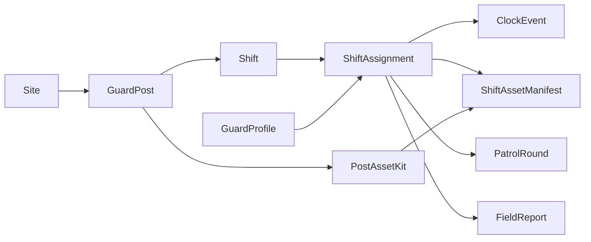
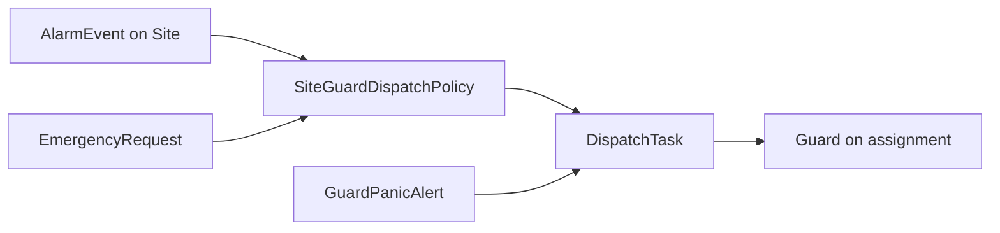

# SecureHub system overview

SecureHub is an operations platform that combines **intruder alarm monitoring** (via Hik-Partner Pro), **physical guarding** (workforce, patrols, dispatch), **emergency response**, and **billing** in one backend. Different people use different surfaces; they share sites and events but not the same menus.

---

## Product pillars

| Pillar | Who uses it | What it does |
|--------|-------------|--------------|
| **Alarm / sites** | Customers (mobile), operations staff | Arm, disarm, zones, live status, alarm events, site handover |
| **Guarding** | Guards (mobile), guarding staff (console) | Hire guards, schedule shifts, patrol proof, reports, assets, SOS |
| **Emergency** | Customers (mobile), dispatchers (console) | Emergency requests, assign staff, lifecycle to resolved |
| **Billing** | Billing staff, system | Subscriptions, packages, payments; can lock customer alarm access |
| **Platform** | Admins | Staff users, customers, broadcast messages, audit logs, settings |

---

## Four access layers

SecureHub does **not** use one “user type.” Access is layered:

```mermaid
flowchart TB
  subgraph layer1 [Operator console]
    Staff["Staff user is_staff=true"]
    Role["StaffOperatorProfile.role"]
    Staff --> Role
    Role --> Console["/console/ sidebar modules"]
  end
  subgraph layer2 [Alarm customer]
    CustUser["Mobile user"]
    CSA["CustomerSiteAccess per site"]
    CustUser --> CSA
    CSA --> AlarmAPI["Alarm / site APIs"]
  end
  subgraph layer3 [Field guard]
    GuardUser["User linked to GuardProfile"]
    GuardUser --> MeAPI["/api/v1/guarding/me/"]
  end
  subgraph layer4 [Guarding client]
    ClientUser["B2B client user"]
    CPA["ClientPortalAccess per site"]
    ClientUser --> CPA
    CPA --> ClientPortal["/console/client/guarding/"]
  end
```

| Layer | Model | Login / entry |
|-------|--------|----------------|
| Operator console | `StaffOperatorProfile` + `console.*` permissions | `/console/login/` |
| Alarm customer | `CustomerSiteAccess` | Mobile app (not console) |
| Field guard | `GuardProfile` → optional `User` | Mobile app → guard APIs |
| Guarding client | `ClientPortalAccess` | `/console/client/guarding/` (any user with a row) |

A single `User` can hold multiple layers (e.g. staff who is also linked as a guard), but each layer is checked independently.

Details: [operator-rbac.md](operator-rbac.md).

---

## Entity spine (guarding)

Most guarding work follows this chain:

**Parallel lifecycles:**

- **Recruitment:** `GuardApplicant` → (hire) → `GuardProfile` (starts **inactive** until compliance) → **active**
- **Incidents:** `GuardPanicAlert` or `AlarmEvent` / `EmergencyRequest` → `DispatchTask` → guard mobile + dispatch console
- **Back office:** `ShiftAssignment` → `GuardTimesheet` → `GuardInvoice`

---

## How alarm, emergency, and guarding connect

- **Sites** are the anchor: alarm panels, optional **guard posts**, subscriptions, and map position.
- **Dispatch** can be created automatically from alarms or emergencies when site policy allows (`dispatch_bridge`, signals).
- **Guarding dispatch console** (`/console/guarding/dispatch/`) is where staff assign guards, resolve panic, and track tasks.
- **Emergency console** (`/console/emergency/`) handles the emergency-request queue (mobile-initiated), not the same UI as intruder alarms.

---

## When to use which console area

Use this when you are logged into `/console/` and are not sure where to go:

| I need to… | Go to |
|------------|--------|
| See company-wide KPIs or run Hik sync | **Dashboard** `/console/` |
| See all sites on a map / guard positions | **Global Map** `/console/map/` |
| Group sites on the map | **Map zones** `/console/map/zones/` |
| Handle mobile emergency requests | **Emergency** `/console/emergency/` |
| Hire someone / review applications | **Guarding → Applicants** `/console/guarding/applicants/` |
| Manage active guards, credentials | **Guarding → Guards** `/console/guarding/guards/` |
| Define posts, post orders, kits on posts page | **Guarding → Posts** `/console/guarding/posts/` |
| Schedule shifts, clock events, asset manifests on shift | **Guarding → Shifts** `/console/guarding/shifts/` |
| Catalog depots, stock, kits, policies, open manifests | **Guarding → Assets** `/console/guarding/assets/` |
| Patrol routes, QR codes, rounds | **Guarding → Patrols** `/console/guarding/patrols/` |
| Review guard field reports | **Guarding → Reports** `/console/guarding/reports/` |
| SOS, dispatch tasks, welfare | **Guarding → Dispatch** `/console/guarding/dispatch/` |
| Timesheets, invoices, contracts | **Guarding → Back office** `/console/guarding/back-office/` |
| Provision site, arm/disarm, customer access | **Sites** `/console/sites/` → site console |
| Subscriptions and payments | **Billing** `/console/subscriptions/` |
| Mobile end-users (alarm app) | **Customers** `/console/customers/` |
| Push notifications to users/groups | **Messaging** `/console/broadcast/` |
| Alarm/event history | **Audit logs** `/console/logs/` |
| Staff accounts and roles | **Staff users** `/console/users/` (restricted) |

---

## Automation (background)

Celery tasks in the guarding app handle reminders and escalations, including:

- Missed welfare checks and patrol rounds
- Late clock-in / no-show detection
- Credential and document expiry warnings
- Dispatch SLA nudges
- Timesheet generation hooks

Staff still resolve exceptions in the console; automation creates visibility and workflow events (`GuardingEventLog`).

---

## Surfaces outside the console

| Surface | URL / API | Audience |
|---------|-----------|----------|
| Public guard apply | `/apply/guard/` | Job applicants (when `GUARD_PUBLIC_APPLY_ENABLED`) |
| Guard mobile | `/api/v1/guarding/me/...` | Field guards |
| Staff guarding API | `/api/v1/guarding/...` | Integrations / admin tools (`IsAdminUser`) |
| Client guarding portal | `/console/client/guarding/` | B2B clients with `ClientPortalAccess` |
| Alarm mobile | Site/alarm REST APIs | Customers with `CustomerSiteAccess` |

---

## Next steps

- **Capabilities by module:** [feature-guide.md](feature-guide.md)
- **Console how-to:** [user-guide-staff-console.md](user-guide-staff-console.md)
- **Guarding playbook:** [user-guide-guarding-ops.md](user-guide-guarding-ops.md)
