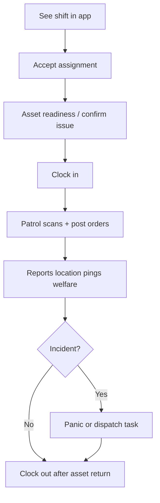

# User guide: field guard (mobile app)

For guards who work shifts using the SecureHub **mobile app** (Flutter scaffold in `securehub_mobile/`). The backend identifies you via a `User` account linked to a **`GuardProfile`**.

API reference: [guard-mobile-api.md](guard-mobile-api.md)  
Supervisor console playbook: [user-guide-guarding-ops.md](user-guide-guarding-ops.md)

---

## Prerequisites

| Requirement | Why |
|-------------|-----|
| `GuardProfile` exists | Created when HR hires you from Applicants |
| Status **active** | Inactive guards are blocked from field actions |
| User login linked to profile | Mobile auth uses your user account |
| Compliance complete | Credentials/training verified before activation |
| Assignment on a published shift | You must be assigned to work |

Check with HR in **Guards** (`/console/guarding/guards/`) if login or shifts are missing.

---

## Your shift day (typical flow)

### 1. View and accept shift

- Open **My shifts** (`GET /api/v1/guarding/me/shifts/`).
- **Accept** (`POST .../accept/`) or **decline** (`.../decline/`) while status is `assigned`.
- Read **post orders** (`GET me/post-orders/`) for site instructions.

### 2. Assets (equipment custody)

Supervisor may build a **manifest** before you arrive.

| Step | API / app |
|------|-----------|
| Check readiness | `GET me/shifts/<assignment_id>/assets/readiness/` |
| View manifest | `GET me/shifts/<assignment_id>/assets/` |
| Confirm you received items | `POST .../assets/confirm-issue/` |

**Strict policy:** Clock-in may be **rejected** until required assets are issued (supervisor issues from console).  
**Advisory policy:** You may clock in with a warning if items are not issued yet.

**Clock-out:** Strict posts may require returns before clock-out. Return physical items to supervisor; they record returns in console.

### 3. Clock in and out

- **Clock in:** `POST me/shifts/<assignment_id>/clock/` with `event_type: clock_in` and GPS if required.
- Stay **clocked in** during the shift — location pings may require an active clock-in.
- **Clock out:** same endpoint with `event_type: clock_out` after assets returned (if policy requires).

Assignment status moves: `accepted` → `clocked_in` → `clocked_out`.

### 4. Patrol

When a **patrol round** is scheduled for your shift:

1. Start round when app shows it (`scheduled` → `in_progress`).
2. At each **checkpoint**, scan QR or submit GPS scan: `POST me/patrol-rounds/<round_id>/scan/`.
3. **Complete round:** `POST .../complete/`.

Missed rounds may be flagged to supervisors automatically.

### 5. Reports and location

| Action | API |
|--------|-----|
| Submit incident/activity report | `POST me/reports/` |
| Use templates | `GET me/report-templates/` |
| Background location | `POST me/location/` (while clocked in) |

Reports may need **staff approval** before clients see them.

### 6. Welfare checks

If prompted:

- `GET me/welfare-checks/`
- `POST me/welfare-checks/<id>/confirm/` when safe

### 7. Panic (SOS)

- `POST me/panic/` — creates `GuardPanicAlert`.
- Dispatchers see it in **Guarding → Dispatch** and may assign a **dispatch task**.

Use only for real emergencies.

### 8. Dispatch tasks

When assigned a task (alarm, emergency, or panic follow-up):

| Action | API |
|--------|-----|
| List tasks | `GET me/dispatch-tasks/` |
| Accept | `POST me/dispatch-tasks/<id>/accept/` |
| En route | `.../en-route/` |
| Arrived | `.../arrive/` |
| Resolved | `.../resolve/` |

### 9. Timesheets

- View submitted hours: `GET me/timesheets/`
- Payroll/invoicing is handled in console **Back office** — you do not approve invoices in the app.

---

## Optional self-service

| Feature | API |
|---------|-----|
| Availability | `GET/POST me/availability/` |
| Leave requests | `GET/POST me/leave-requests/` |
| Shift swaps | `GET/POST me/shift-swaps/` |

Approval happens in the staff console, not in the app.

---

## What you cannot do in the app

| Not available on mobile | Where it happens |
|----------------------|------------------|
| Hire applicants | Staff console Applicants |
| Create shifts | Staff Shifts |
| Issue serial radios (barcode pick) | Supervisor Shifts/Assets console |
| Change asset catalog | Staff Assets |
| Arm/disarm customer alarms | Customer alarm app |
| View other guards' pay rates | Staff only |

---

## Troubleshooting

| Problem | What to do |
|---------|------------|
| No shifts listed | Confirm assignment exists and shift is published |
| Clock-in rejected (400) | Complete asset issue or ask supervisor for override |
| Cannot log in | HR must link User ↔ GuardProfile and set active |
| Patrol scan fails | Verify correct checkpoint QR and active round |
| Push notification deep link | Payload includes `route` per [guard-mobile-api.md](guard-mobile-api.md) |

---

## See also

- [system-overview.md](system-overview.md) — how guarding fits the platform
- [feature-guide.md](feature-guide.md) — Guard REST API summary
