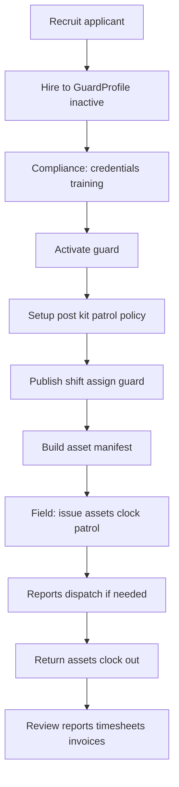

# User guide: guarding operations (staff console)

End-to-end playbook for scheduling, field operations, assets, and dispatch. You need **`console.manage_guarding`** (or view-only for read-only pages).

**URLs base:** `/console/guarding/`

---

## The guarding lifecycle (big picture)

---

## 1. Recruitment

### Public applications

- Applicants use **`/apply/guard/`** (when enabled).
- They receive a reference on the success page.
- Record appears in **Applicants** with `source=public_web`.

### Console applicants

1. **Applicants** `/console/guarding/applicants/`
2. **New applicant** — intake modal (application + supporting records tabs).
3. Move status: `applied` → `screening` → `interview` → `background_check` → `offered`.
4. **Download PDF** for records.
5. When ready: **Hire** (or `POST` hire action) — creates **`GuardProfile` as inactive**; applicant becomes `hired`.

### Activate the guard

1. **Guards** `/console/guarding/guards/`
2. Add **credentials**, training, documents until compliance passes.
3. Set status to **active** (blocked if compliance gaps remain).

---

## 2. Site setup (before shifts)

Do this per **site** that will have guards.

| Task | Where | What to create |
|------|--------|----------------|
| Define posts | **Posts** `/console/guarding/posts/` | `GuardPost` (name, geofence, supervisor) |
| Standing orders | Same page | `PostOrder` (instructions) |
| Patrol path | **Patrols** `/console/guarding/patrols/` | Checkpoints, route, link to post |
| Standard equipment | **Assets** → Post kits tab, or Posts | `PostAssetKit` + lines (asset type, qty) |
| Asset rules | **Assets** → Policies | `GuardingAssetPolicy` per site or post (advisory/strict, clock rules) |
| Contract (optional) | **Back office** | `GuardContract` rates/SLA |

Print checkpoint **QR** from Patrols (`/console/guarding/checkpoints/<id>/qr.svg`).

---

## 3. Scheduling

1. **Shifts** `/console/guarding/shifts/`
2. Create **shift** on a post: start/end, required guards, publish when ready.
3. **Assign guard(s)** to shift → `ShiftAssignment` in `assigned` state.
4. Guard accepts on mobile → `accepted` (or staff can manage status in console where supported).

### Asset manifest (before or during shift)

**Option A — Shifts page**

1. Find assignment in **Shift asset custody** panel.
2. Choose **depot**, **Build manifest** (pulls lines from default post kit).

**Option B — Assets page**

1. **Open manifests** tab `/console/guarding/assets/?tab=manifests`
2. **Create manifest for assignment** at bottom, or operate on existing manifests.

**Rebuild draft:** Only when manifest is **draft** and all lines still **pending** — **Rebuild from kit** replaces lines from default kit.

---

## 4. Live shift (console supervisor)

Guards perform most steps on mobile; supervisors monitor and assist from console.

| Task | Where |
|------|--------|
| Issue radio / keys | **Shifts** custody panel or **Assets** → Open manifests |
| Return / lost / damaged | Same — per-line Return / Lost / Damaged |
| Close manifest | **Close manifest** when all lines settled |
| Override strict clock block | **Override** with reason (clock-in or clock-out phase) |
| Add/remove pending line | **Assets** or Shifts — draft manifest only |
| Clock events | **Shifts** — view clock in/out |
| Welfare checks | **Shifts** / **Dispatch** |
| Complete patrol round (if needed) | **Patrols** — mark round complete |
| Panic / dispatch | **Dispatch** `/console/guarding/dispatch/` |

### Asset policy behavior

| Mode | Clock-in without issue | Clock-out without return |
|------|------------------------|---------------------------|
| **Advisory** | Warning logged; clock allowed | Warning; clock allowed |
| **Strict** | Blocked if policy requires issue | Blocked if policy requires return |

Post-level policy overrides site default.

---

## 5. Incidents

1. **Dispatch** `/console/guarding/dispatch/`
2. **Panic (SOS):** acknowledge → resolve; may spawn **DispatchTask**.
3. **Dispatch tasks:** assign guard → track accept → en route → arrived → resolved.
4. Alarms/emergencies may auto-create tasks per **site dispatch policy** — same dispatch UI.

**Global map** `/console/map/` shows guard positions for coordination.

---

## 6. Close-out

| Task | Where |
|------|--------|
| Review field reports | **Reports** — approve/reject |
| Timesheets | **Back office** — approve, export CSV |
| Invoices | **Back office** — generate from approved timesheets |
| Offboarding | **Guards** / back office checklist when guard leaves |
| Equipment | Ensure manifests closed; units not left `issued` |

Clients with **ClientPortalAccess** see approved reports in [user-guide-guarding-client.md](user-guide-guarding-client.md).

---

## Where do I do this? (quick reference)

| I need to… | Page | URL |
|------------|------|-----|
| Review job applications | Applicants | `/console/guarding/applicants/` |
| Hire someone | Applicants → Hire | `/console/guarding/applicants/<id>/hire/` |
| Fix guard license / compliance | Guards | `/console/guarding/guards/` |
| Add a gate post | Posts | `/console/guarding/posts/` |
| Schedule tonight's shift | Shifts | `/console/guarding/shifts/` |
| Issue a radio | Shifts or Assets (manifests) | `/console/guarding/shifts/` or `.../assets/?tab=manifests` |
| Register new asset type | Assets → Catalog | `/console/guarding/assets/?tab=catalog` |
| Set strict clock-in rules | Assets → Policies | `/console/guarding/assets/?tab=policy` |
| Log unit maintenance | Assets → Catalog → Edit unit | `/console/guarding/assets/?tab=catalog` |
| Create patrol route | Patrols | `/console/guarding/patrols/` |
| Handle SOS | Dispatch | `/console/guarding/dispatch/` |
| Approve guard report | Reports | `/console/guarding/reports/` |
| Export timesheets | Back office | `/console/guarding/back-office/` |
| See KPI trends | Analytics | `/console/guarding/analytics/` |

---

## Common mistakes

| Mistake | Fix |
|---------|-----|
| Guard cannot clock in | Check manifest issued, policy strict mode, assignment `accepted` |
| Rebuild kit does nothing | Manifest must be **draft** with only **pending** lines |
| Cannot delete asset type | Deactivate if units or manifest lines exist |
| Duplicate policy error | One policy per site **or** per post, not both |
| Open manifest missing on Assets | Only non-closed statuses listed; use Shifts for closed history |

---

## See also

- [feature-guide.md](feature-guide.md) — Guarding section
- [user-guide-guard-mobile.md](user-guide-guard-mobile.md) — what guards do on the phone
- [operator-rbac.md](operator-rbac.md) — who can open these pages
